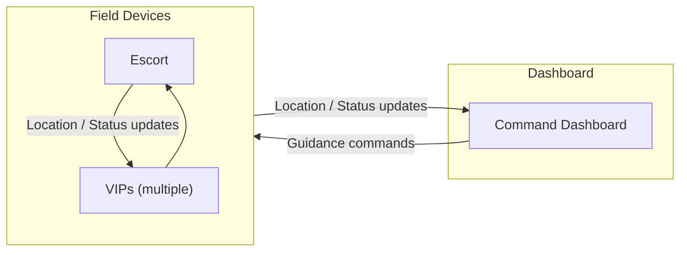

# Escorted VIP Tour

## Architecture

## Demo

### Introduction (slide)
- **Demo**: show Geotriggers + Dynamic Entities in a real-time situational awareness workflow.
- **Scenario**
    - A team of VIP scientists is attending a conference on the Esri campus. The group will be taken on a walking tour of the campus and, because of the profile of these scientists, the tour requires a security escort.
    - Goal: Ensure the safety of the VIPs while also providing a seamless experience for
        - VIPs, Security Escort, and Campus Security
- To facilitate this we built multiple applications:
    - Field Apps for tour members (VIP + escort)
    - Command Dashboard for campus security to monitor the tour in real-time
- As the tour moves:
    - Field devices share live location and status updates over a peer-to-peer field network.
    - Apps are field-network ready and do not rely on cloud services.
- Each VIP scientist runs the VIP app:
    - Uses two Geotriggers (perimeter + warning ring) to determine status of the VIP (`In`, `Warning`, or `Out`).
    - Geotrigger notifications are the authoritative VIP status source.
- Security Escort app:
    - Maintains a live VIP roster using a custom DynamicEntityDataSource built from the VIP status updates.
- Campus security dashboard:
    - Uses a custom DynamicEntityDataSource for live escort + VIP operating picture.
    - Supports VIP filtering (for example, `Warning`) and simple guidance commands.
- Fire up the demo:
    - Run in simulation mode for this session (same apps also support live mode).

### Command Dashboard Walkthrough
- **WPF** app running on our windows laptop (could be written in any language supported by Maps SDK)
- **Map** with our tour ongoing
    - Notice the moving points from our **DynamicEntityLayer** of VIPs and Escort
    - **Escort** is the shield symbol in the center
    - **VIPs** are the labeled points
    - Based on **DynamicEntityDataSource** that we build on the fly from VIP / Escort location updates
- The **security perimeter** is a 25 meter buffer around the escort, with a warning ring just inside of that
    - duplicate dimensions as the moving fence used by the **Geotriggers** in the VIP apps
    - No **Geotriggers** in the dashboard - status is assigned in the VIP field apps
- The right side of the app shows
    - **General** status of the operation (tour)
    - **VIP list** in the UI panel that changes with the state of the VIPs
- When a VIP crosses outside of the security perimeter (all based on DEDS events)
    - General status changes on the operation panel (heading bar status)
    - Color changes on the map
    - Individual VIP status changes in the VIP roster
    - Note the **Stop / Hurry** directive buttons
- Operator can send **stop / hurry** directives to the VIP device

### `Escort / VIP` Device Walkthrough
- Field app is a **.NET/MAUI** app (iOS, Android, WinUI)
    - could be written in any language supported by Maps SDK
- **Escort** app shows:
    - general status of the tour
    - VIP roster with status
        - maintained with **DynamicEntityDataSource** from VIP status updates
- **VIP** app shows:
    - VIP name
    - Status message
    - Distance and direction to the escort
- If VIP goes out of range
    - banner is shown encouraging the VIP to rejoin the group
- If campus security sends a **stop / hurry** directive from the dashboard
    - another banner is shown directing the VIP to hold or hurry to rejoin the escort
- Status of the VIP is completely controlled by the **Geotrigger** notifications
    - **Geotrigger** is the authoritative source of truth for VIP status (at the edge of the system)
- Notice that there is no Map in any of these apps
    - Real-time API does not require a map to run effectively

### Running Demo - switch between Dashboard and Field Apps
- VIP outside security perimeter
    - Search for VIP (**QueryDynamicEntitiesAsync**)
    - Show VIP track history
    - Send Command guidance to VIP

### Code

- Field app snippets
    - VIP: Build escort perimeter geotrigger / monitors: [EnsurePerimeterMonitorsAsync](../EscortVIPs/FieldMobileApp/MainPage.Geotriggers.cs#L30)
    - VIP: Update escort location fence: [UpdateEscortFenceAsync](../EscortVIPs/FieldMobileApp/MainPage.Geotriggers.cs#L102)
    - Escort: Dynamic entity source for VIP roster: [EscortVipDynamicEntityDataSource](../EscortVIPs/FieldMobileApp/RealTime/VipDynamicEntityDataSource.cs#L8)
- Dashboard snippets
    - Attach dynamic entity layer to map: [DynamicEntityLayer initialization](../EscortVIPs/CommandDashboard/ViewModels/MainViewModel.cs#L62)
    - Query: [ApplyVipFilterAsync](../EscortVIPs/CommandDashboard/ViewModels/MainViewModel.cs#L144)

### Take aways
- Dashboard and field apps share one live operating picture
- **Geotrigger** drives immediate edge awareness and action
- **DynamicEntities** provide operational context
