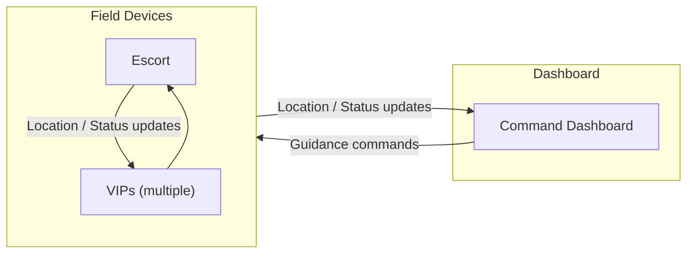

# EscortVIPs Scenario Brief

## Scenario

A team of VIP scientists is attending a conference on the Esri campus. While they are here, the group will be taken on a walking tour of the campus and, because of the profile of these scientists, the tour requires a security escort. We want to ensure the safety of the VIPs while also providing a seamless experience for the VIPs, security escort, and campus security.

## Architecture

## How it Works

The end-to-end flow follows this pipeline:

1. Escort and VIP field roles publish live position updates.
2. VIP evaluates geotrigger proximity relative to Escort movement.
3. VIP state transitions are classified as In, Danger, or Out.
4. The dashboard ingests field updates and presents a single live map view.
5. The dashboard can send simple guidance actions back to field roles.

## Capabilities and Behaviors

- The field network is peer-to-peer: Escort and VIP devices exchange updates directly.
- VIP devices share location and status data over the field network to both Dashboard and Escort.
- Escort devices share location data over the field network to both Dashboard and VIP devices.
- The Dashboard monitors the tour in realtime.
- The Dashboard can provide guidance commands to VIP devices.
- VIP devices send notifications when a VIP is out of, or nearing the edge of, the escort security perimeter.
- Escort includes a VIP roster view with current status per VIP (`In`, `Warning`, `Out`).
- VIP devices are the authoritative source of each VIP status.
- VIP status is computed with geotriggers using a buffered Escort location as a moving fence.
- Escort uses a Dynamic Entity data source to maintain VIP location/state and roster status.
- Dashboard uses a Dynamic Entity data source to maintain both VIP and Escort entities on the map and in a UI panel.
- Dashboard can query and display filtered subsets of VIPs.

## Demo Script

“This demo shows how we use Geotriggers and Dynamic Entities together in a real-time situational awareness workflow.

Our scenario: a team of VIP scientists is attending a conference on the Esri campus. While they are here, the group will be taken on a walking tour of the campus and, because of the profile of these scientists, the tour requires a security escort. We want to ensure the safety of the VIPs while also providing a seamless experience for the VIPs, security escort, and campus security.

To facilitate this, we built two applications, a field app for the VIPs and security escort, and a command and control dashboard to monitor the tour in real-time. As the tour moves, field devices share live location and status updates across a peer-to-peer field network (simulated in this case) to each other and to the dashboard.

Each VIP scientist will carry a mobile device running our field app with a VIP role. The VIP app:
- Evaluate the VIP's proximity to the escort, classifying their status as `Inside`, `Outside`, or `Close to the Edge` of a moving perimeter around the escort.
- Sends a notification to the VIP when they are nearing or outside the escort perimeter.
- Shares status changes and location updates with both the escort and the dashboard.
Each VIP device uses a pair of geotriggers to evaluate the VIPs proximity to a moving fence built around a buffered escort location. If a VIP nears or crosses that perimeter, the device immediately raises a notification on the device and publishes the VIP status on the network.

The security personnel run our field app with the escort role. The escort app:
- Shares its location with VIP devices and the dashboard.
- Maintains a roster of VIPs with their current status.
The escort app uses a custom DynamicEntityDataSource to provide the live operating picture of VIP statuses.

Campus security monitors the tour in real-time using our Dashboard app. The Dashboard:
- ingests VIP and Escort location and status updates from the field to populate a custom DynamicEntityDataSource that is used to maintain current status and location.
- can send simple guidance commands back to VIP devices.
- can query and display filtered subsets of VIPs, such as showing only VIPs that are in a `Warning` state.
